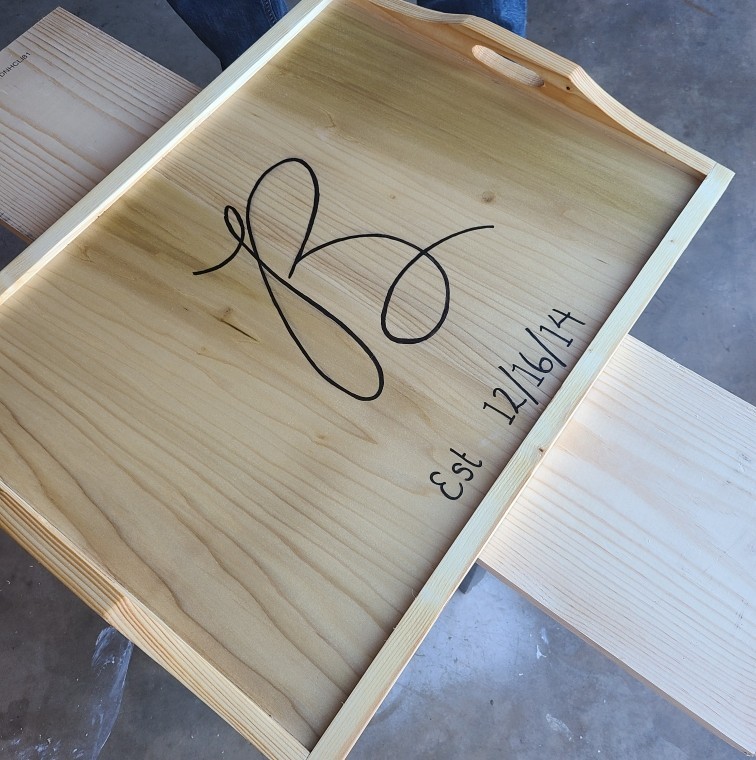

```{r setup, include=FALSE}
knitr::opts_chunk$set(echo = TRUE)
```


{#id .class width=25% height=25%}

### Professional:  
Hi, my name is Kevin Boyd. I obtained my undergraduate degree from the University of Oklahoma in Microbiology in May 2016. After graduating I worked in Dr. David Jones' lab and Dr. Christopher Sansam's lab at Oklahoma Medical Research Foundation (OMRF) as a research technician for 5 years. While working in Dr. Sansam's lab I had the opportunity to work directly with very large data sets and learn how to code in bash, R, and Python both locally and using OMRF's high performance computing cluster.  

I graduated from SMU in the Fall of 2023 earning a 4.0 GPA for a Masters of Science in Data Science. I have heavy exposure to cutting edge machine learning techniques and with that experience I developed an automated cell segmentation and classification program for my masters thesis. I am currently working as a Senior Bioinformatic Analyst providing support for many different Principal Investigators. My main focus in this role has been pipeline development for multiple processes including: RNA seq, scRNA seq, Cut and Run, Cut and Tag, CHiP seq, ChEC seq, CRISPR screens, and using machine learning to automate image classification. It is amazing to see how technology has progressed so quickly to give us some of our modern tools. What excites me the most is leveraging those tools to solve even more complex problems.

 ---

### Personal:  
Outside of work, I’m a naturally curious and active person. I’m an avid tennis player and enjoy running and going on long walks with my wife and our two dogs. I especially enjoy activities that allow me to be creative. I’ve recently started playing the guitar again, something I loved in high school, and have taken to woodworking. I even competed on a workplace rowing team, where we won two regattas together. Whether it’s building something with my hands or learning a new skill, I love the process of improving my abilities in every facet of life.

I’m a big Star Wars and Lord of the Rings fan, and I occasionally attend sci-fi and anime conventions. I haven’t had many opportunities to travel recently, but I always keep a destination list ready for the next adventure with my wife. A surprising and fun fact about me is that I lived overseas when I was young and I spent parts of my childhood in both Karachi, Pakistan, and Jakarta, Indonesia. Those early experiences gave me a global perspective that continue to shape how I view life and work today.

I’m driven by a desire to keep learning and bettering myself. I find the process of starting something from scratch and improving day by day incredibly fulfilling. I also enjoy competition, especially on the tennis court, where I get to test my abilities against other people of similar skill. Currently I am in a 4.5 USTA league and play multiple times a week.

Whether it's building a bioinformatics pipeline, crafting something in the garage, or learning a new song on my guitar, I’m happiest when I’m growing and creating.

 ---

<!-- Full-width image at the top -->
<div style="text-align: center; margin-bottom: 20px;">
  
  <p style="margin-top: 8px;">Galaxy's Edge with Wife</p>
</div>

<div style="text-align: center; margin-bottom: 20px;">
  
  <p style="margin-top: 8px;">Our dogs</p>
</div>

<div style="text-align: center;">
  
  <p style="margin-top: 8px;">Small woodworking project</p>
</div>

</div>

 ---


