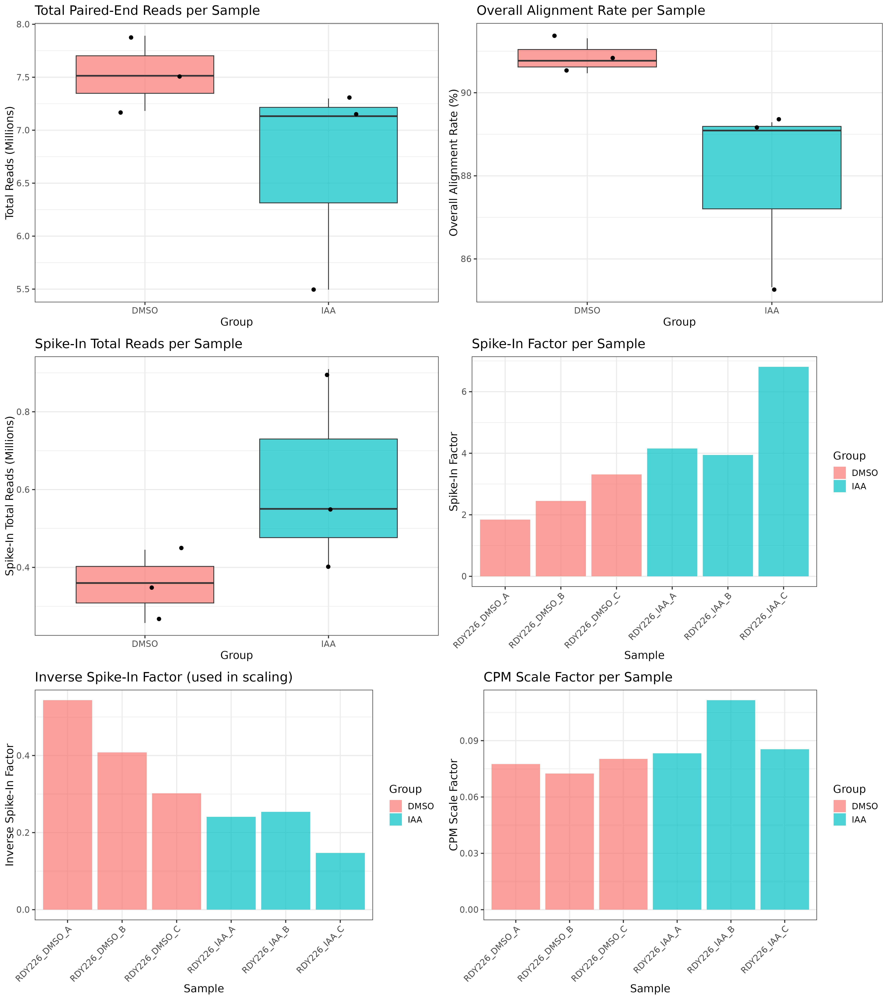
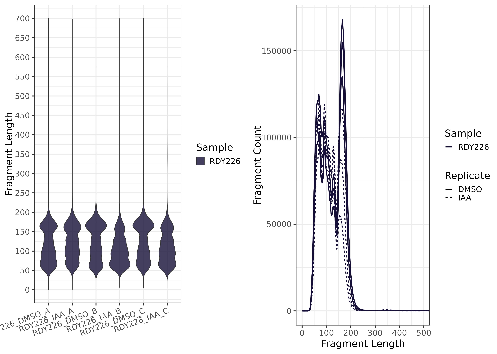

```{r setup, include=FALSE}
knitr::opts_chunk$set(echo = TRUE)
```


[](https://doi.org/10.5281/zenodo.15232549)
[](https://opensource.org/licenses/Apache-2.0)
[](https://github.com/DonczewLab/ChEC-Seq_Analysis)

# ChEC-seq Analysis Snakemake Workflow

  
- OpenAI. (2025). Scientific data visualization: CHEC-seq pipeline schematic [AI-generated image]. DALL-E. Retrieved from ChatGPT interface.

---

## 1) Project Description

**ChEC-seq Analysis Snakemake Workflow** is a Snakemake pipeline designed for Chromatin Endogenous Cleavage (ChEC) experiments. Rather than manually invoking each step (QC, trimming, alignment, coverage generation, mean coverage merging, WIG conversion, and plotting alignment metrics), this pipeline automates the entire process from **raw FASTQ** inputs to **multiple coverage tracks** (raw, CPM, and spike-in normalized), as well as merged replicates to create an average signal track via a `merge_group` column in `samples.csv`. CPM tracks are created by calculating the total number of reads in a specified include list region (e.g., non-rDNA genome), then generating a scale factor as the reciprocal of reads per million (i.e., 1 / (total_reads / 1,000,000)), which is applied during coverage generation.

### Key Features

- **Flexible Spike-In Normalization**  
  + Simultaneously aligns reads to the primary **S. cerevisiae** genome and a **spike-in** genome (e.g., *S. pombe*), calculating a per-sample scaling factor to accurately normalize coverage.

- **Automatic Trimming & QC**  
  + FastQC runs on raw FASTQs
  + MultiQC summarizes all QC reports into one unified HTML report
  + BBDuk or Trim Galore handles adapter removal 

- **Multiple Coverage Outputs**  
  + **Raw** BigWig, BedGraph, & Wig: unnormalized coverage  
  + **CPM** BigWig, BedGraph, & Wig: a scale factor is generated as the reciprocal of reads per million and applied to normalize coverage to a read depth of 1×10⁶
  + **Spike-In** BigWig, BedGraph, & Wig: additional normalization via spike-in factor  
  + **Average Coverage** BigWig, BedGraphs & Wig: average signal for single samples and merged sets

- **Merge Coverage by Group**  
  + A `merge_group` column in `samples.csv` allows replicates to be combined into a mean coverage bedGraph and BigWig/WIG

- **Modular, Parallel Workflow**  
  + Each step defined as a Snakemake rule with explicit inputs/outputs  
  + Snakemake manages HPC job submissions, ensuring fast parallel processing of samples and the ability to only rerun needed steps

- **Automated Plot Generation**  
  + Summary plots include:
    - **Alignment statistics** (paired reads, alignment rate, spike-in reads, spike-in factor)
    - **Fragment length distributions** per sample using violin and line plots

---

## 2) Intended Use Case

This pipeline is **ideal** for performing **ChEC-seq** analysis. It is a user-friendly workflow with customizable `samples.csv` and `config.yml` files, enabling reproducible and flexible analysis:

- Start with raw FASTQ reads  
- Use an external spike-in organism (e.g., *S. pombe* or *D. melanogaster*) for normalization   
- Produce coverage files for genome browsers (BigWigs, BedGraphs, or WIGs)  
- Merges replicates by condition or replicate group

By offering multiple coverage normalizations and easy HPC integration, this pipeline streamlines data preparation for subsequent analysis or visualization (e.g., IGV tracks, coverage heatmaps), including **mean coverage** tracks for replicate sets.

---

## 3) Dependencies and Configuration

All parameters and module versions are specified in `config/config.yml`

**Key fields include**:
- `use_trim_galore`: true or false (default = false) set to true to use Trim Galore instead of BBDuk
- `use_filtering`: true or false (default = true) set to false to skip `alignmentSieve` filtering
- `scer_genome`: path to the **S. cerevisiae** Bowtie2 index  
- `spikein_genome`: path to the **Spike In** Bowtie2 index (e.g., S. pombe)  
- `bbmap_ref`: adapter sequence reference for BBDuk  
- `binSize`: bin size for coverage generation  
- `fastqc, bowtie2, samtools, deeptools, bedtools, trim_galore, bbduk, ucsc, python, R`: module versions for HPC

**Changing Genomes**  
+ If using a different spike-in (e.g. *D. melanogaster*), just update the relevant Bowtie2 index and references in `config.yml`.

**Tool Versions and Modules**  
+ The `config/config.yml` file specifies all software and specific versions  
+ The `config/cluster_config.yml` file defines resource requirements for each Snakemake rule  

---

## 4) Tools & Modules

This pipeline uses the following tools via HPC environment modules:  

- **FastQC** for read quality checks
- **MultiQC** for summarizing FastQC reports
- **BBDuk** (in **BBMap**) for adapter trimming
- **Trim Galore** for adapter trimming (optional)
- **Bowtie2** for alignments  
- **Samtools** for BAM conversions/indexing
- **DeepTools** `alignmentSieve` for optional filtering of aligned BAMs & `bamCoverage` for coverage generation  
- **Bedtools** for Average Signal files
- **Python** for spike-in factor calculations and WIG conversions
- **UCSC** `bedGraphToBigWig` to generate average signal BigWigs from BedGraphs
- **R** to generate alignment metric plots

---

## 5) Example Data

A minimal test dataset can be placed in a `resources/` folder (not included currently). Update `samples.csv` to point to these FASTQs for a quick test run. Once confirmed, replace with your personal ChEC-seq data.

---

## 6) Explanation of `samples.csv`

`config/samples.csv` defines which FASTQ files to process, what the naming convention will be, and which samples to create average signal tracks. An example `samples.csv` is provided below:  

| sample           | fastq1                              | fastq2                              | merge_group |
|------------------|-------------------------------------|-------------------------------------|-------------|
| **RDY73_DMSO_A** | /path/RDHTS192_S63_R1_001.fastq.gz  | /path/RDHTS192_S63_R2_001.fastq.gz  | DMSO        |
| **RDY73_IAA_A**  | /path/RDHTS193_S64_R1_001.fastq.gz  | /path/RDHTS193_S64_R2_001.fastq.gz  | IAA         |
| **RDY73_DMSO_B** | /path/RDHTS195_S66_R1_001.fastq.gz  | /path/RDHTS195_S66_R2_001.fastq.gz  | DMSO        |
| **RDY73_IAA_B**  | /path/RDHTS196_S67_R1_001.fastq.gz  | /path/RDHTS196_S67_R2_001.fastq.gz  | IAA         |
| **RDY73_DMSO_C** | /path/RDHTS198_S69_R1_001.fastq.gz  | /path/RDHTS198_S69_R2_001.fastq.gz  | DMSO        |
| **RDY73_IAA_C**  | /path/RDHTS199_S70_R1_001.fastq.gz  | /path/RDHTS199_S70_R2_001.fastq.gz  | IAA         |

+ **sample**: unique sample ID that will serve as file naming convention downstream  
+ **fastq1** and **fastq2**: file paths to paired-end fastq files  
+ **merge_group**: optional label for merging coverage across replicates (e.g., DMSO vs. IAA). Samples with the same `merge_group` will be averaged into a mean coverage BedGraph and BigWig/WIG.  

---

## 7) Output Structure  

  The pipeline generates output across several folders:  
  
1. **Trimming and QC**  
  + FastQC HTML reports in `results/qc/fastqc/`
  + MultiQC HTML reports in `results/qc/multiqc/`

2. **Aligned Files**  
  + Primary BAMs in `results/alignment/scer`
  + If filtering is enabled, a `results/alignment/scer/{sample}_filtering.log` will be written for each sample  
  + Spike-in BAMs in `results/alignment/spikein`  

3. **Spike-In Factors**  
  + `spikein_factors.csv` in `results/spikein_factors/`  
    + lists scer/dmel read counts and a `spikein_factor` for each sample  

4. **CPM Scale Factors**
  + `cpm_scale_factors.csv` in `results/scale_reads/`
    + lists include region read counts and `scale_factor` for each sample

5. **BigWig Files**
  + `*_raw.bw` in `results/bigwig/raw/`  
  + `*_cpm.bw` in `results/bigwig/cpm/`  
  + `*_spikein.bw` in `results/bigwig/spikein/`
  + `*_cpm_mean.bw` in `results/bigwig/cpm_mean/`


6. **BedGraph Files**
  + `*_raw.bg` in `results/bedgraph/raw/`  
  + `*_cpm.bg` in `results/bedgraph/cpm/`  
  + `*_spikein.bg` in `results/bedgraph/spikein/`    
  + `*_cpm_mean.bg` in `results/bedgraph/cpm_mean/`

7. **WIG Files**
  + `*_raw.wig` in `results/wig/raw/`  
  + `*_cpm.wig` in `results/wig/cpm/`  
  + `*_spikein.wig` in `results/wig/spikein/`       
  + `*_cpm_mean.wig` in `results/wig/cpm_mean/`

8. **Alignment Statistics Plot**
  + `alignment_stats.png` in `results/plots/`
    + Total **paired-end reads** per sample (boxplot)
    + **Overall alignment rate** per sample (boxplot)
    + **Total spike-in reads** per sample (boxplot)
    + **Spike-in factor** per sample (barplot, grouped by replicate)

9. **Fragment Length Distribution Plot**:
  + `fragment_length_plot.png` in `results/plots/`
    + A two-panel violin and line plot showing the distribution of **insert fragment lengths** for each sample, calculated from properly paired alignments.

---

## 8) Example of QC Plots

Below are some example plots generated by the pipeline.  

| 1. **Alignment Stats Plot.png**                                              | 2. **Fragment Length Plot**                                                |
| :--------------------------------------------------------------------------: | :------------------------------------------------------------------------: |
|                           |                    |
| *Plots showing alignment metrics of primary and spike-in genome*             | *Plot showing the fragment length distributions*                           |

---

## 9) Instructions to run on Slurm managed HPC
9A. Download version controlled repository
```
wget https://github.com/DonczewLab/ChEC-Seq_Analysis/releases/download/v1.1.1/ChEC-Seq_Analysis-1.1.1.tar.gz
tar -xzf ChEC-Seq_Analysis-1.1.1.tar.gz
rm ChEC-Seq_Analysis-1.1.1.tar.gz
cd ChEC-Seq_Analysis-1.1.1
```
9B. Load modules
```
module purge
module load slurm python/3.10 pandas/2.2.3 numpy/1.22.3 matplotlib/3.7.1
```
9C. Modify samples and config file
```
vim config/samples.csv
vim config/config.yml
```
9D. Dry Run
```
snakemake -npr
```
9E. Run on HPC with config.yml options
```
sbatch --wrap="snakemake -j 20 --use-envmodules --rerun-incomplete --latency-wait 300 --cluster-config config/cluster_config.yml --cluster 'sbatch -A {cluster.account} -p {cluster.partition} --cpus-per-task {cluster.cpus-per-task}  -t {cluster.time} --mem {cluster.mem} --output {cluster.output} --job-name {cluster.name}'"
```

---

## 10) Citation

If you use this workflow in your research, please cite:

**Boyd, K.A.**, Ridenour, J., & Donczew, R. (2025). *ChEC-Seq_Analysis: A reproducible Snakemake workflow for Chromatin Endogenous Cleavage (ChEC) experiments*. Zenodo. https://doi.org/10.5281/zenodo.15232549

[](https://doi.org/10.5281/zenodo.15232549)

---

## 11) Authorship & Contributions

**Kevin A. Boyd** – Designed and implemented the Snakemake workflow for a Slurm-managed HPC environment, modularized the pipeline structure, implemented all processing steps, integrated spike-in normalization support, designed quality control plots, and created the documentation.  

**John Ridenour** – Developed original ChEC-seq bash scripts used as the foundation for this pipeline.  

**Rafal Donczew** – Principal Investigator; provided project direction, conceptual guidance, and experimental data for pipeline development.  

This work was developed under the guidance of Rafal Donczew as part of a COBRE-funded collaborative effort. While the pipeline was built specifically for use within the Donczew Lab, it is broadly applicable to ChEC-seq data analysis in other research settings.

---

## 12) License

This project is licensed under the **Apache 2.0**. See the [LICENSE](LICENSE) file for details.  

[](https://opensource.org/licenses/Apache-2.0)
