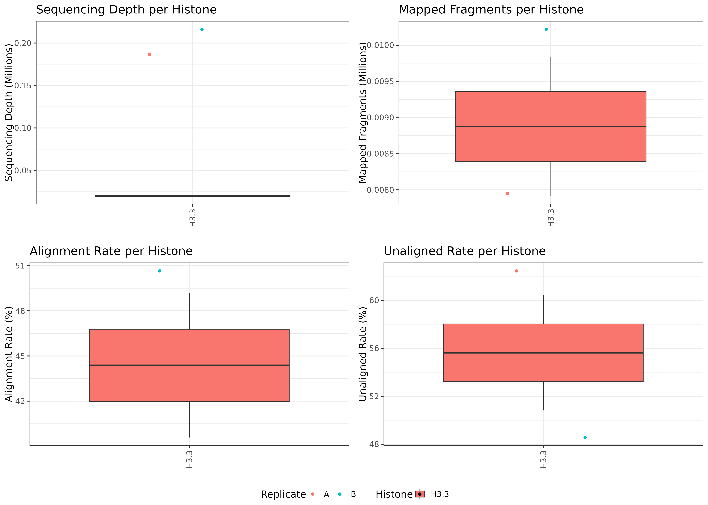
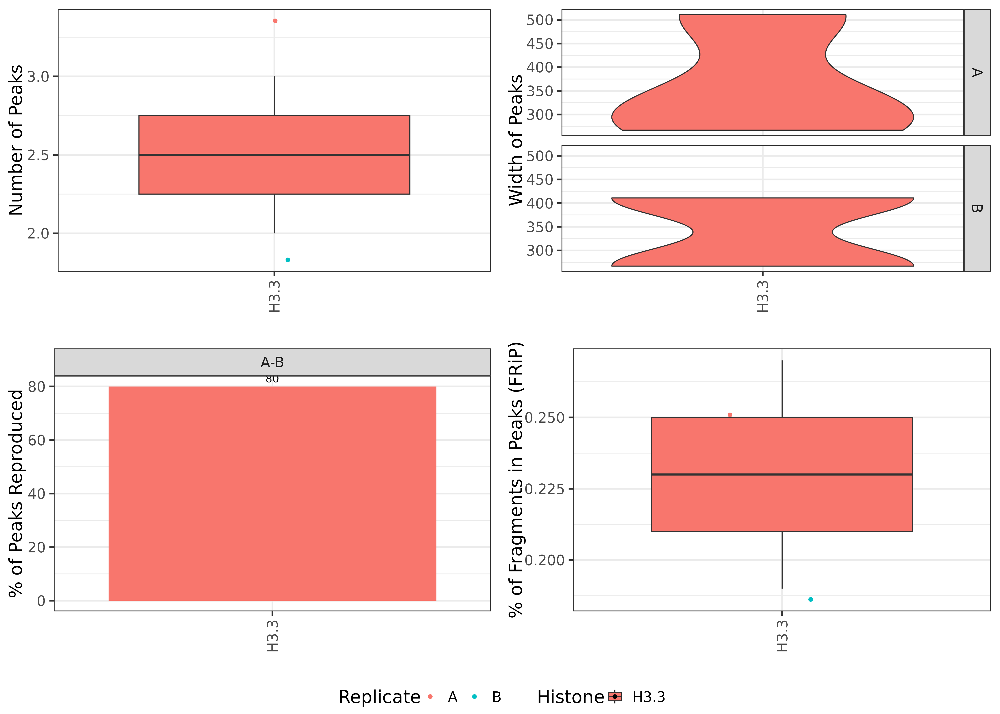
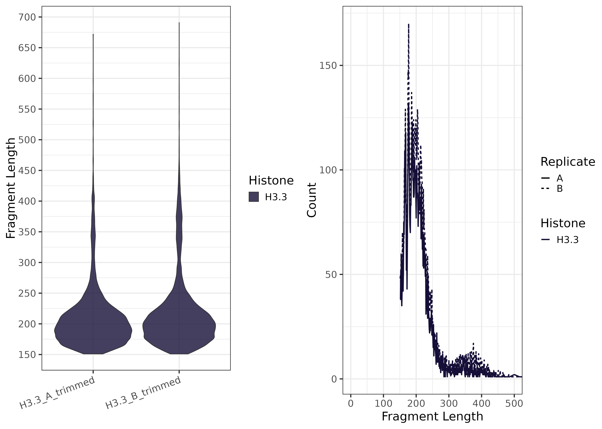

```{r setup, include=FALSE}
knitr::opts_chunk$set(echo = TRUE)
```


[](https://doi.org/10.5281/zenodo.15232228)

# CutandTag_Analysis_Snakemake

+ OpenAI. (2024). Cartoon image of scissors cutting DNA and protein and DNA playing tag. DALL-E. Retrieved from OpenAI.

# 1) Project Description
CutAndTag_Analysis_Pipeline is a Snakemake pipeline adapted from the protocol by Ye Zheng, Kami Ahmad, and Steven Henikoff (dx.doi.org/10.17504/protocols.io.bjk2kkye). This pipeline is designed to process Cut-and-Tag sequencing data to facilitating the analysis of chromatin accessibility and DNA-protein interactions. It includes steps for quality control, read alignment, BAM to BigWig conversion, peak calling, and various visualizations, enabling high-resolution profiling of protein-DNA binding sites.

The pipeline provides automated quality checks, including FastQC and FastQ Screen reports, and performs read alignment with Bowtie2. Outputs include raw and scaled BigWig files, which allow users to visualize signal intensity across the genome. Additionally, peak calling is performed using MACS2, and fragment length and alignment summary plots are generated for in-depth data exploration. The workflow is automated with Snakemake, and dependencies are managed through module environments, ensuring reproducibility and flexibility.

A compact dataset is included within the repository for testing purposes, along with example scripts for analyzing publicly available Cut-and-Tag datasets. This pipeline extends the original protocol, offering a robust framework for both routine analysis and more complex studies.

Downstream analysis can be performed in the [CutandTag_ReplicatePeak_Analysis](https://github.com/JK-Cobre-Help/CutandTag_ReplicatePeak_Analysis) snakemake pipeline. This pipeline starts with already aligned and filtered BAM files, focusing on the identification of reproducible peaks, the generation of consensus peak sets, and the visualization of overlaps and signal distributions across multiple samples or experimental conditions.

# 2) Explanation of `samples.csv`

**IMPORTANT:** Always update `samples.csv` with your sample, FASTQ file paths, histone, and replicate information before running.

This file should be placed in the `config/` directory and must contain the following columns:

 ---

| sample             | fastq1                                 | fastq2                                 | histone          | replicate    |
|--------------------|----------------------------------------|----------------------------------------|------------------|--------------|
| K27ac_1_control    | path/to/K27ac_1_control_R1.fastq.gz    | path/to/K27ac_1_control_R2.fastq.gz    |H27ac_Control     |1             |
| K27ac_2_control    | path/to/K27ac_2_contorl_R1.fastq.gz    | path/to/K27ac_2_control_R1.fastq.gz    |K27ac_Control     |2             |
| K27me3_1_treatment | path/to/K27me3_1_treatment_R1.fastq.gz | path/to/K27me3_1_treatment_R1.fastq.gz |K27me3_Treatment  |1             |
| K27me3_2_treatment | path/to/K27me3_2_treatment_R1.fastq.gz | path/to/K27me3_2_treatment_R1.fastq.gz |K27me3_Treatment  |2             |

 ---

+ **sample**: Unique name used for all output files.
+ **fastq1 / fastq2**: Paths to R1 and R2 FASTQ files.
+ **histone**: Mark name (used in plots). Include control or treatment label in `histone`_`control` format
+ **replicate**: Include replicate number (e.g., `1`, `2`, `A`, `B`, etc.)

Use informative `sample` names that match your design. Examples:

+ `H3K27ac_rep1_control`
+ `H3K4me3_rep2_treatment`
+ `H3.3_A_trimmed`
+ `H2AX_1_H3K27ac`

Include both the histone and samlpe type in `histone` column. This determines how samples are grouped together. Following these practices will improve downstream plot labeling and reproducibility metrics.

# 3) Explanation of config.yml
Note. Make sure to check config.yml for the appropriate genome alignment

The config.yml is used to identify the file path of the bowtie2 genome index, specify effective genome size and genome for macs2. There is also information about specific modules and version numbers to maintain dependencies in the snakemake workflow. Running the mm10 genome does not require any modifications to the config.yml. When using the hg38 genome the following need to be modified with the information provided in the config.yml but commented out.

Run hg38 samples in snakemake pipeline
- config.yml 
    + change bowtie2 genome index file path
    + change bamCoverage effective genome size
    + change macs2 genome size


# 4) Examples of Output from Test Files in Repo

Below are some example plots generated by the pipeline.  

| 1. **Alignment Summary Plot**                                                         | 2. **Peak Summary Plot**                                                                   |
| :-----------------------------------------------------------------------------------: | :----------------------------------------------------------------------------------------: |
|                             |                                       |
| *Summary of alignment stats*                                                          | *Summary of called peak stats*                                                             |

| 3. **Fragment Length Plot**                                                           | 4. **Fragment Count Correlation Plot**                                                     |
| :-----------------------------------------------------------------------------------: | :----------------------------------------------------------------------------------------: |
|                               |                              |
| *Fragment Length summary plots*                                                       | *Correlation plot of fragment counts*                                                      |


# 5) Instructions to run on Slurm managed HPC
5A. Download verson controlled repository
```
wget https://github.com/JK-Cobre-Help/CutandTag_Analysis_Snakemake/releases/download/v1.0.3/CutandTag_Analysis_Snakemake-1.0.3.tar.gz
tar -xzf CutandTag_Analysis_Snakemake-1.0.3.tar.gz
rm CutandTag_Analysis_Snakemake-1.0.3.tar.gz
cd CutandTag_Analysis_Snakemake-1.0.3
```
5B. Load modules
```
module purge
module load slurm python/3.10 pandas/2.2.3 numpy/1.22.3 matplotlib/3.7.1
```
5C. Modify samples and config file
```
vim samples.csv
vim config.yml
```
5D. Dry Run
```
snakemake -npr
```
5E. Run on HPC with config.yml options
```
sbatch --wrap="snakemake -j 999 --resources mem_mb=200000 --use-envmodules --latency-wait 300 --cluster-config config/cluster_config.yml --cluster 'sbatch -A {cluster.account} -p {cluster.partition} --cpus-per-task {cluster.cpus-per-task}  -t {cluster.time} --mem {cluster.mem} --output {cluster.output}'"
```

# 6) Citations
Zheng, Y., Ahmad, K., & Henikoff, S. (2019). CUT&Tag for efficient epigenomic profiling of small samples and single cells. Protocols.io, dx.doi.org/10.17504/protocols.io.bjk2kkye
