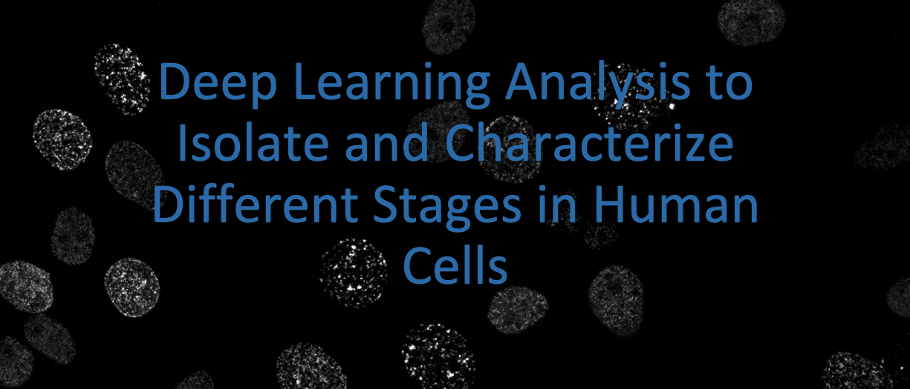
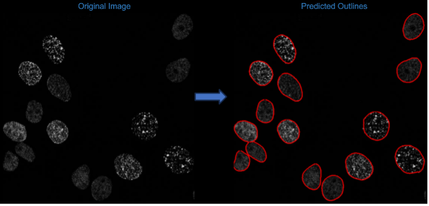
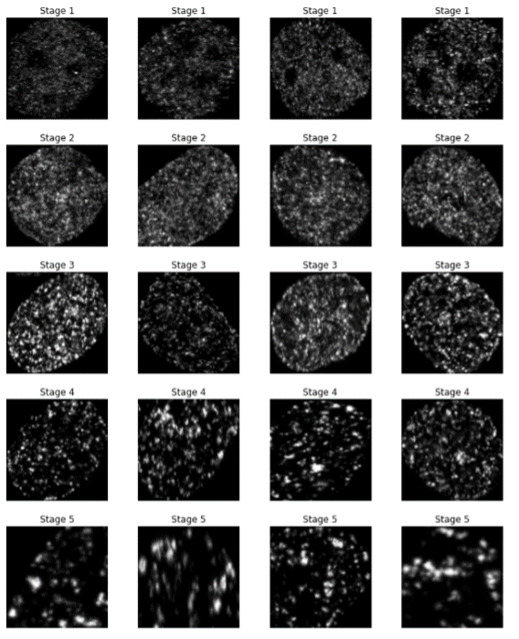
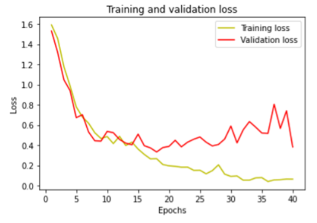
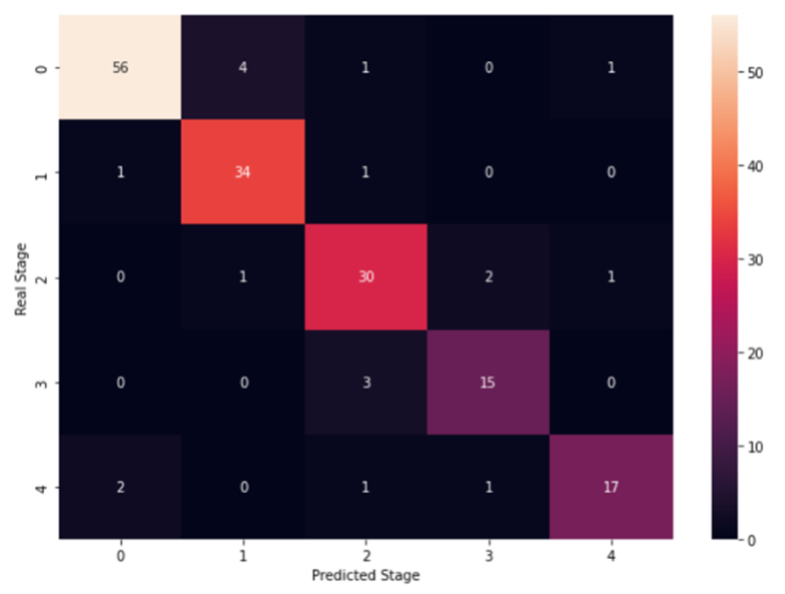

```{r setup, include=FALSE}
knitr::opts_chunk$set(echo = TRUE)
```


[](https://doi.org/10.5281/zenodo.10247155)

# Automated_S-phase_Image_Classification

- Deep Learning Image analysis to automatically segment and classify cells into 5 distinct patterns
- Start with an image or set of images and preprocess
- Run automated segmentation using Cellpose base model or human-in-the-loop training
- Use CNN to classify images

## Previous studies have classified cells in S-phase into 5 distinct patterns

- In order to make this process more reproducible and increase the throughput we have created automated segmentation and classification models in order to isolate and identify the stage each of the stages the cells are in.

## Cellpose Masks

- These are an example of the masks drawn by cellpose. We use those masks to identify the location of each cell to output an individual tif for each cell. 

## Annotated Images

- It is important to have a large selection of annotated images to train the model. Here is an example of annotated images for each of the stages we want to classify.

## CNN Architecture

- This image shows the CNN architecture that worked best for our application

# Result Metrics


- These plots show the accuracy and loss of our model. We can see that we achieved an 86.5% accuracy overall.

# Classification Results

- This final plot is a heatmap showing each of the stages and the correct and incorrect classifications.

