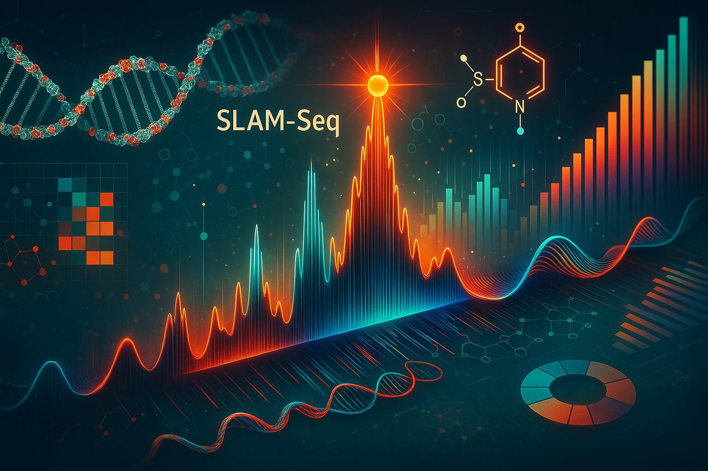

```{r setup, include=FALSE}
knitr::opts_chunk$set(echo = TRUE)
```


[](https://doi.org/10.5281/zenodo.16106788)
[](https://opensource.org/licenses/Apache-2.0)

# SLAM-Seq_Analysis

  
- OpenAI. (2025). Scientific data visualization: SLAM-seq pipeline schematic [AI-generated image]. DALL-E. Retrieved from ChatGPT interface.

---

## 1) Project Description

**SLAM-Seq_Analysis** is a modular, high-throughput Snakemake pipeline designed to analyze **SLAM-Seq** data. It quantifies RNA synthesis and degradation by detecting **T>C transitions**. This pipeline processes raw **paired-end FASTQ** files through quality control, UMI extraction, adapter trimming, alignment, mutation counting, and context-specific mutation analysis using **SLAM-Dunk** and **Alleyoop**. The final output includes BAM files, CSVs, summary files, and MultiQC reports.

It supports both **default 1-TC** and **custom 2-TC** read count thresholds for downstream comparative analysis and includes fully automated **MultiQC** reports for raw, trimmed, and SLAM-Dunk outputs. Additionally, the pipeline optionally supports a **spike-in genome** (e.g., S. pombe), allowing for parallel alignment and mutation quantification for normalization and QC purposes. Spike-in analysis is controlled by the flag `use_spikein` in the `config.yml` and produces a parallel set of filtered BAMs, mutation calls, and summary reports in a separate output directory `results/slamdunk_spikein`.  

### Key Features  

+ **UMI Support**  
  + Extracts UMIs using `fastp`, allowing for duplicate-aware alignment and quantification  

+ **Multiple Adapter Trimming Methods Set in `config.yml` (optional)**  
  + Choose between **Trim Galore** or **BBduk**  
  + `use_trim_galore`: toggle between BBduk and Trim Galore  

+ **Comprehensive QC Reports**  
  + FastQC on raw and trimmed reads  
  + MultiQC reports summarize results in unified HTML  

+ **Spike-In Genome Support in `config.yml` (optional)**  
  + `use_spikein`: toggle between true/false to enable/disable spike-in genome alignment  
  + `spikein_genome`, `spikein_bed`: reference FASTA and BED for spike-in genome  
  + Generates its own BAMs, tcount files, and QC reports  

+ **SLAM-Dunk Integration**  
  + `slam-dunk all`: Align, filter, SNP call, and count  
  + `slam-dunk count`: Rerun mutation quantification with 2-TC threshold  

+ **Alleyoop Analysis**  
  + Generates mutation rates, context, UTR rates, SNP evaluation  
  + Summarizes and merges mutation counts across samples  
  + Outputs T>C mutation information per read and UTR position  

+ **Scalable and Reproducible**  
  + Parallelizable via Snakemake  
  + Designed for Slurm HPC environments  

---

## 2) Intended Use Case

This pipeline is built for researchers analyzing **RNA turnover** via **SLAM-seq**, especially when interested in:  

+ Mutation counts (T>C transitions) per gene or region  
+ Comparing samples using 1-TC vs. 2-TC thresholds  
+ Producing summary metrics and mutation contexts  
+ Running in a reproducible and modular HPC environment  
+ Supports optional spike-in controls (e.g., *S. pombe*) to facilitate normalization across samples or conditions.  

Starting from raw paired-end FASTQs, it provides all necessary intermediate and final outputs, from filtered BAMs to mutation summaries and log diagnostics.  

---

## 3) Dependencies and Configuration

All user-defined settings and tool versions are declared in `config/config.yml`.

**Key fields include**:
+ `scer_genome`: reference genome FASTA  
+ `bed_file`: annotation BED file  
+ `bbmap_ref`: adapter reference for BBduk (optional)  
+ `umi_loc`, `umi_len`: UMI extraction parameters  
+ `trim_5p`, `max_read_length`, `min_base_qual`: parameters for SLAM-Dunk  
+ `use_trim_galore`: Boolean to toggle trimming tool  
+ `stringency`, `length`: used by Trim Galore  

**Tool Versions**  
+ `fastqc`, `multiqc`, `fastp`, `bbmap`, `trim_galore`, `slamdunk`, `samtools`, `varscan`, `nextgenmap`

---

## 4) Tools & Modules

This pipeline uses the following tools via HPC environment modules:  

+ **FastQC** for raw and trimmed read QC  
+ **MultiQC** for unified reporting of QC metrics  
+ **Fastp** for UMI extraction  
+ **BBduk** or **Trim Galore** for adapter trimming  
+ **SLAM-Dunk** for alignment, mutation calling, filtering  
+ **Alleyoop** for contextual mutation analysis and merging  
+ **Samtools**, **VarScan**, **NextGenMap** used internally by SLAM-Dunk  
+ **Snakemake** for workflow management

---

## 5) Example Data

A minimal test dataset can be placed in a `resources/` folder (not included currently). Update `samples.csv` to point to these FASTQs for a quick test run. Once confirmed, replace with your personal SLAM-seq data.

---

## 6) Explanation of `samples.csv`

`config/samples.csv` defines which FASTQ files to process, what the naming convention will be, and which samples to create average signal tracks. An example `samples.csv` is provided below:  

| sample           | fastq1                              | fastq2                              | merge_group |
|------------------|-------------------------------------|-------------------------------------|-------------|
| **RDY73_DMSO_A** | /path/RDHTS192_S63_R1_001.fastq.gz  | /path/RDHTS192_S63_R2_001.fastq.gz  | DMSO        |
| **RDY73_IAA_A**  | /path/RDHTS193_S64_R1_001.fastq.gz  | /path/RDHTS193_S64_R2_001.fastq.gz  | IAA         |
| **RDY73_DMSO_B** | /path/RDHTS195_S66_R1_001.fastq.gz  | /path/RDHTS195_S66_R2_001.fastq.gz  | DMSO        |
| **RDY73_IAA_B**  | /path/RDHTS196_S67_R1_001.fastq.gz  | /path/RDHTS196_S67_R2_001.fastq.gz  | IAA         |
| **RDY73_DMSO_C** | /path/RDHTS198_S69_R1_001.fastq.gz  | /path/RDHTS198_S69_R2_001.fastq.gz  | DMSO        |
| **RDY73_IAA_C**  | /path/RDHTS199_S70_R1_001.fastq.gz  | /path/RDHTS199_S70_R2_001.fastq.gz  | IAA         |

+ **sample**: unique sample ID that will serve as file naming convention downstream  
+ **fastq1** and **fastq2**: file paths to paired-end fastq files  
+ **merge_group**: optional group for downstream averaging or plotting  

---

## 7) Output Structure  

  The pipeline generates output across several folders:  

1. **Quality Control**
   + `results/qc/raw/fastqc/` — FastQC HTML/ZIP for raw FASTQs  
   + `results/qc/raw/multiqc/` — MultiQC report for raw reads  
   + `results/qc/trimmed/fastqc/` — FastQC on trimmed FASTQs  
   + `results/qc/trimmed/multiqc/` — MultiQC report for trimmed reads

2. **Preprocessing**
   + `results/fastp/` — FASTQs with UMIs extracted  
   + `results/trimmed/` — Adapter-trimmed FASTQs  

3. **SLAM-Dunk Core Output**
   + `results/slamdunk_scer/filter/` — Filtered BAM files  
   + `results/slamdunk_scer/count/` — 1-TC tcount TSVs, logs, bedgraphs  
   + `results/slamdunk_scer/count_twotcreadcount/` — 2-TC threshold tcount files

4. **Alleyoop Output**
   + `alleyoop/rates/` — overall mutation rates  
   + `alleyoop/tccontext/` — T>C context profiles  
   + `alleyoop/utrrates/` — UTR region mutation rates  
   + `alleyoop/snpeval/` — SNP evaluation outputs  
   + `alleyoop/tcperreadpos/` — mutation per read  
   + `alleyoop/tcperutrpos/` — mutation per UTR position  
   + `alleyoop/dump/` — `.sdunk` read info dump  
   + `alleyoop/summary_*` — summary stats for 1-TC and 2-TC thresholds  
   + `alleyoop/merge_*` — merged summary tables across all samples

5. **Final QC**
   + `results/qc/slamdunk_scer/multiqc/` — Summary MultiQC report of SLAM-Dunk logs

6. **Spike-In Genome Output (if `use_spikein: true`)**  
    + `results/slamdunk_spikein/filter/` — filtered BAMs aligned to spike-in genome  
    + `results/slamdunk_spikein/count/` — 1-TC tcount TSVs, logs, bedgraphs  
    + `results/slamdunk_spikein/count_twotcreadcount/` — 2-TC threshold tcount files  
    + `results/slamdunk_spikein/alleyoop/` — all standard mutation metrics (rates, context, UTRs, SNP eval, dump, summaries, merges)  
    + `results/qc/slamdunk_spikein/multiqc/` — MultiQC summary report for spike-in genome  

*This output mirrors the primary genome `slamdunk_scer/` and can be used for spike-in normalization or quality control tracking.*

---

## 8) Instructions to Run on HPC  

8A. Download version controlled repository
```
wget https://github.com/DonczewLab/SLAM-Seq_Analysis/releases/download/v1.0.1/SLAM-Seq_Analysis-1.0.1.tar.gz
tar -xzf SLAM-Seq_Analysis-1.0.1.tar.gz
rm SLAM-Seq_Analysis-1.0.1.tar.gz
cd SLAM-Seq_Analysis-1.0.1
```
8B. Load modules
```
module purge
module load slurm python/3.10 pandas/2.2.3 numpy/1.22.3 matplotlib/3.7.1
```
8C. Modify samples and config file
```
vim config/samples.csv
vim config/config.yml
```
8D. Dry Run
```
snakemake -npr
```
8E. Run on HPC with config.yml options
```
sbatch --wrap="snakemake -j 20 --use-envmodules --rerun-incomplete --latency-wait 300 --cluster-config config/cluster_config.yml --cluster 'sbatch -A {cluster.account} -p {cluster.partition} --cpus-per-task {cluster.cpus-per-task}  -t {cluster.time} --mem {cluster.mem} --output {cluster.output} --job-name {cluster.name}'"
```

---

## 9) Citation  

If you use this workflow in your research, please cite:  

**Boyd, K.A.**, Ridenour, J., & Donczew, R. (2025). *SLAM-Seq_Analysis: A reproducible Snakemake workflow for RNA metabolism analysis using SLAM-Seq data*. Zenodo. https://doi.org/10.5281/zenodo.16106788

[](https://doi.org/10.5281/zenodo.16106788)

---

## 10) Authorship & Contributions

**Kevin A. Boyd** – Designed and implemented the Snakemake workflow for a Slurm-managed HPC environment, modularized the pipeline structure, implemented all processing steps, integrated spike-in normalization support, and created the documentation.  

**John Ridenour** – Developed original SLAM-Seq bash scripts used as the foundation for this pipeline.  

**Rafal Donczew** – Principal Investigator; provided project direction, conceptual guidance, and experimental data for pipeline development.  

This work was developed under the guidance of Rafal Donczew as part of a COBRE-funded collaborative effort. While the pipeline was built specifically for use within the Donczew Lab, it is broadly applicable to SLAM-Seq data analysis in other research settings.  

---

## 11) License

This project is licensed under the **Apache 2.0**. See the [LICENSE](LICENSE) file for details.  

[](https://opensource.org/licenses/Apache-2.0)
